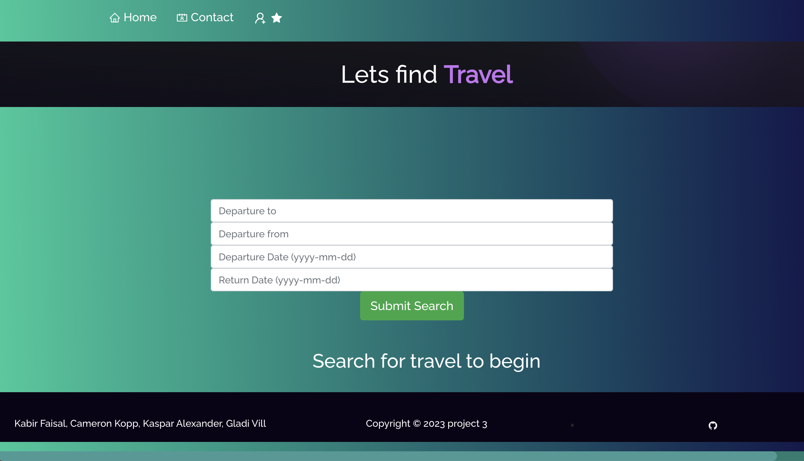
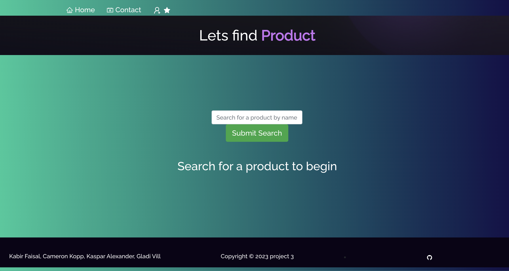

# Explore Market
a website where users can find and shop travel bookings and products in a single platform.
# Table-of-Contents
  * [Deployed URL](#deployed-url)
  * [UserStory](#userstory)
  * [Acceptance Criteria](#acceptance-criteria)
  * [Git Repo](#git-repo)
  * [Dependency](#dependency)
  * [Test case](#test-case)
    * [Test Dependency](#test-dependency)
  * [Screenshots](#screenshots)
    * [Workflow](#workflow)
    * [App](#app)

## [Deployed URL](#table-of-contents)
```
TBD
```

## [User Story](#table-of-contents)
```
 As a user I want an application where I can explore and shop travel bookings as well as products in a single platform to have more accessibility and convenience.
```

## [Acceptance Criteria](#table-of-contents)
```
Use React for the front end.
Use GraphQL with a Node.js and Express.js server.
Use MongoDB and the Mongoose ODM for the database.
Use queries and mutations for retrieving, adding, updating, and deleting data.
Be deployed using Heroku (with data).
Have a polished UI.
Be responsive.
Be interactive (i.e., accept and respond to user input).
Include authentication (JWT).
Protect sensitive API key information on the server.
Have a clean repository that meets quality coding standards (file structure, naming conventions, best practices for class and id naming conventions, indentation, quality comments, etc.).
Have a high-quality README (with unique name, description, technologies used, screenshot, and link to deployed application).
```

## [Git Repo](#table-of-contents)
```
https://github.com/kwalexander/explore-market.git
```
## Tools Used
  * JavaScript
  * Node.js
  * Express
  * React
  * Apollo Server
  * Graphql
  * Mongodb
  * Mongoose
  * Dotenv
  * Heroku
## [Dependency](#table-of-contents)
```
NOTE: if you are copying this repo all you have to do is run 
     
    1. npm i
    2. npm i react-icons
    3. npm i typewriter-effect
    4. npm i react-bootstrap
    5. npm i postcss-loader
    6. npm i react-css-components
    7. npm react-parallax-tilt
    8. npm i react-tsparticles  
    9. npm i react-github-calendar
    10.npm i react-pdf
    11.npm i hash-router
    12. npm i jwt-decode
    13. npm i apollo-boost

    Test:
    1. npm i cypress (TO-DO)

```

# [Screenshots](#table-of-contents)



## [Workflow](#table-of-contents)
### db Schema

### User Map


## [App](#table-of-contents)
